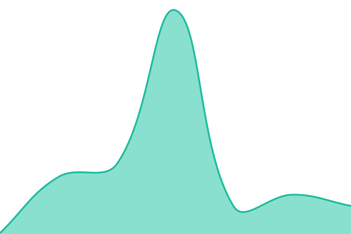

# [📈 Live Status](https://status.cautera.com): <!--live status--> **🟩 All systems operational**

This repository contains the open-source uptime monitor and status page for [Cautera-labs](https://status.cautera.com), powered by [Upptime](https://github.com/upptime/upptime).

With [Upptime](https://upptime.js.org), you can get your own unlimited and free uptime monitor and status page, powered entirely by a GitHub repository. We use [Issues](https://github.com/Cautera-labs/cautera-status/issues) as incident reports, [Actions](https://github.com/Cautera-labs/cautera-status/actions) as uptime monitors, and [Pages](https://status.cautera.com) for the status page.

<!--start: status pages-->
<!-- This summary is generated by Upptime (https://github.com/upptime/upptime) -->
<!-- Do not edit this manually, your changes will be overwritten -->
<!-- prettier-ignore -->
| URL | Status | History | Response Time | Uptime |
| --- | ------ | ------- | ------------- | ------ |
|  [Cautera App](https://app.cautera.com/) | 🟩 Up | [cautera-app.yml](https://github.com/Cautera-labs/cautera-status/commits/HEAD/history/cautera-app.yml) | 

 167ms
     
 | 

<a href="https://status.cautera.com/history/cautera-app">100.00%</a>
    

|  [API Proxy Health](https://app.cautera.com/api/health) | 🟩 Up | [api-proxy-health.yml](https://github.com/Cautera-labs/cautera-status/commits/HEAD/history/api-proxy-health.yml) | 

 402ms
     
 | 

<a href="https://status.cautera.com/history/api-proxy-health">100.00%</a>
    

|  [Trust Center API](https://phyituqxevqqycikqguj.supabase.co/functions/v1/trust-center-data?slug=novapay) | 🟩 Up | [trust-center-api.yml](https://github.com/Cautera-labs/cautera-status/commits/HEAD/history/trust-center-api.yml) | 

 1751ms
     
 | 

<a href="https://status.cautera.com/history/trust-center-api">100.00%</a>
    

|  [Auth (GoTrue)](https://phyituqxevqqycikqguj.supabase.co/auth/v1/health) | 🟩 Up | [auth-go-true.yml](https://github.com/Cautera-labs/cautera-status/commits/HEAD/history/auth-go-true.yml) | 

 52ms
     
 | 

<a href="https://status.cautera.com/history/auth-go-true">100.00%</a>
    

<!--end: status pages-->

[**Visit our status website →**](https://status.cautera.com)

## 📄 License

- Powered by: [Upptime](https://github.com/upptime/upptime)
- Code: [MIT](./LICENSE) © [Anand Chowdhary](https://anandchowdhary.com)
- Data in the `./history` directory: [Open Database License](https://opendatacommons.org/licenses/odbl/1-0/)
